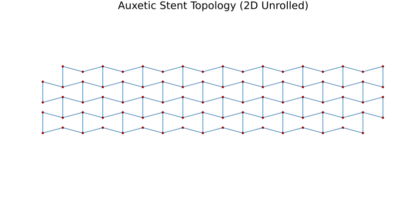
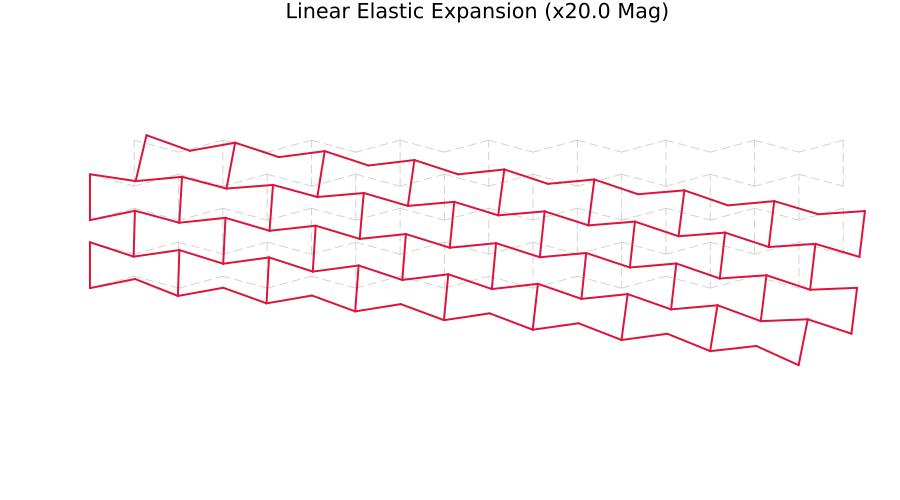

# BiodegradableStent.jl


A high-performance, strictly linear Finite Element Method (FEM) solver and parametric mesh generator for staggered auxetic cardiovascular stents. 

Developed entirely in Julia, this package serves as a technical showcase of **High-Performance Computing (HPC)**, highly optimized `SparseArrays` assembly, and Data-Oriented Design utilizing Julia's powerful *Multiple Dispatch* paradigm.

## 🔬 About the Project
This repository is a distilled, open-source portfolio component extracted from a broader 8-week (60-hour) comprehensive *in-silico* research master plan for the development of advanced biodegradable and shape-memory cardiovascular stents. It isolates and demonstrates the foundational software engineering, mesh topology generation, and linear elastic mechanics of the larger proprietary simulator.

## ✨ Core Features
* **Parametric Topology Engine:** Generates staggered 2D re-entrant (auxetic) mesh topologies with optimized `Dict`-based node deduplication and precise micrometer-scale precision.
* **HPC Sparse Assembly:** Bypasses dense matrix bottlenecks by assembling the global stiffness matrix directly into `SparseMatrixCSC` format, drastically reducing memory footprint and allocation overhead.
* **Data-Oriented Material System:** Leverages Julia's abstract type hierarchy (`AbstractBioMaterial`) and *Multiple Dispatch* to elegantly route behavior for different materials (e.g., Magnesium WE43 vs. Pure Zinc) ensuring peak CPU performance via type stability.
* **Shrinking Core Degradation:** Implements a deterministic uniform degradation kinetic model to simulate structural decay over clinical timelines.

## 🚀 Installation & Setup

Clone the repository and instantiate the local environment to automatically fetch all required dependencies (such as `LinearAlgebra`, `SparseArrays`, and `Plots`).

```julia
# Open the Julia REPL and type:
julia> ]
(@v1.x) pkg> activate .
(BiodegradableStent) pkg> instantiate

## 📊 Examples and Visual Results
The `examples/` directory contains ready-to-run scripts that demonstrate the capabilities of the module. Visual outputs are automatically routed to the `examples/results/` directory using headless rendering.

### 1. Auxetic Topology Generation
Generates the foundational staggered honeycomb structure designed for a negative Poisson's ratio (expansion under tension).



```julia
# Run from the terminal:
# julia examples/01_auxetic_topology.jl

2. Linear Elastic FEM Expansion
Demonstrates the HPC SparseArrays solver handling a purely elastic expansion. The unique auxetic geometry expands radially when stretched axially.



```julia
# Run from the terminal:
# julia examples/02_linear_expansion.jl

3. Material Dispatch & Degradation Kinetics
Simulates 180 days of in-vivo degradation. Demonstrates Multiple Dispatch routing the calculate_corrosion_step function to distinct kinetic models based strictly on the material type provided (MagnesiumWE43 vs ZincPure).


# Run from the terminal:
# julia examples/03_material_dispatch.jl


🧪 Testing
The package includes a comprehensive, zero-allocation mathematical test suite validating material type promotion, HPC memory pre-allocation, stiffness assembly dimensions, and physical bounds.
# Run the test suite from the REPL:
julia> ]
(BiodegradableStent) pkg> test


📄 License
This project is licensed under the MIT License.